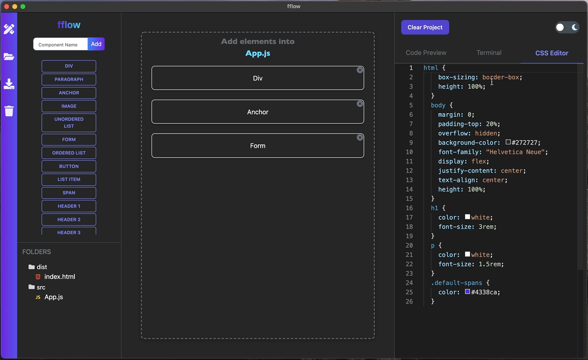
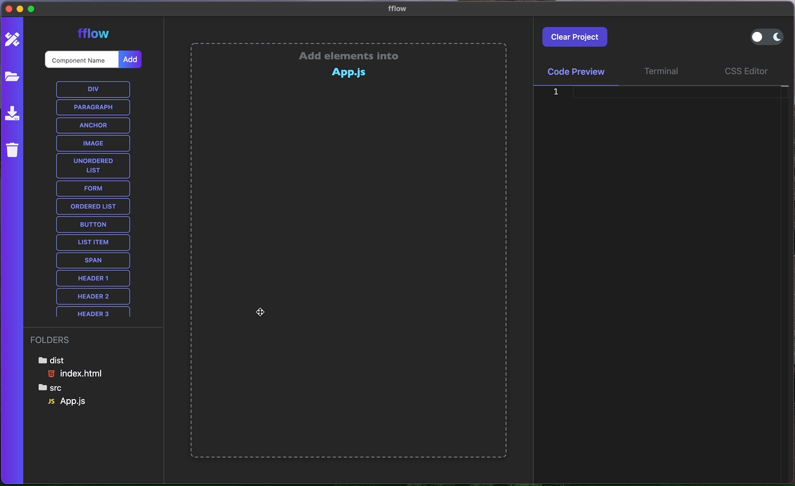
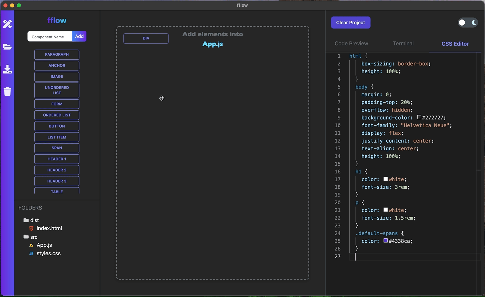
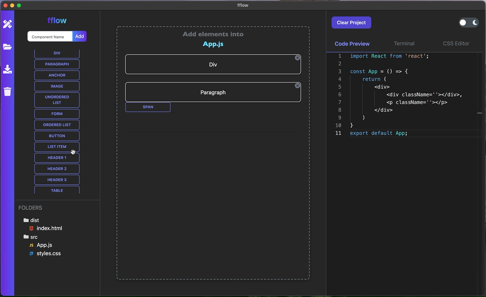

<br />
<div align="center">
  <a href="https://github.com/oslabs-beta/fflow">
    
  </a>

<h3 align="center">fflow</h3>

  <p align="center">
    <strong>Supercharge your React development process</strong>
    <br />
    <a href="https://github.com/oslabs-beta/fflow"><strong>Explore the docs »</strong></a>
    <br />
    <br />
    <a href="https://github.com/oslabs-beta/fflow">View Demo</a>
    ·
    <a href="https://github.com/oslabs-beta/fflow/issues">Report Bug</a>
    ·
    <a href="https://github.com/oslabs-beta/fflow/issues">Request Feature</a>
  </p>
</div>

<p align="center">

  
  
  
    
  <br />
  <br />
  Give a ⭐️ if our project helped or interests you!
</p>

<br />

<details open>
  <summary>Table of Contents</summary>
  <ol>
    <li>
      <a href="#about">About fflow</a>
      <ul>
       <li><a href="#features">Features</a></li>
        <li><a href="#built-with">Built With</a></li>
      </ul>
    </li>
    <li>
      <a href="#getting-started">Getting Started</a>
      <ul>
        <li><a href="#production-mode">Production Mode</a></li>
        <li><a href="#development-mode">Development Mode</a></li>
      </ul>
    </li>
    <li><a href="#run-exported-project">Run Exported Project</a></li>
    <li><a href="#contributors">Contributors</a></li>
    <li><a href="#roadmap">Roadmap</a></li>
    <li><a href="#contributing-guide">Contributing Guide</a></li>
    <li><a href="#license">License</a></li>
  </ol>
</details>

## About fflow

React is the most popular library used by frontend developers today. Yet, getting a React application started requires a too much boilerplate code and unnecessary time.

fflow is a free, open-source developer tool to create React applications rapidly and with minimal effort using the simple drag and drop UI. It combines the most compelling features of Create React App, React ES6 snippets, and a beautiful user experience. Here is a medium article describing the philosophy behind fflow and you can download it here.

We are really excited to launch this alpha version and hope you will download, play around with it, and provide us with feedback.

Visit our website here 👉 https://fflow.dev


### Features

- Drag, Drop, Reorder and Delete HTML Tags
- Create Custom React Components
- Light and Dark Theme based on OS Preferences and Manual Toggle
- Delete Project and Clear Canvas to restart build process
- Live preview in Code editor
- Interactable CSS Code Editor
- Easily switch between files with file tree or on the canvas
- Easy redirect to App.jsx by clicking on the fflow icon
- Export app with preconfigured and versatile webpack
- In-built terminal initializes an instance of the exported app without leaving fflow
- Accessibility features including canvas item highlighting when the HTML tag or Component is picked up

### Built with

- [React.js](https://reactjs.org/)
- [Electron](https://www.electronjs.org/)
- [React-Monaco/Editor](https://github.com/react-monaco-editor/react-monaco-editor)
- [Webpack 5](https://webpack.js.org)
- [TailwindUI](https://tailwindui.com)
- [React–Redux](https://react-redux.js.org)
- [Redux Toolkit](https://redux-toolkit.js.org)
- [React Beautiful DnD](https://github.com/atlassian/react-beautiful-dnd)
- [React Icons](https://react-icons.github.io/react-icons/)
- [Xterm.js](https://xtermjs.org/)
- [node-pty](https://www.npmjs.com/package/node-pty)
- [Jest](https://jestjs.io)
- [React Testing Library](https://testing-library.com/docs/react-testing-library/intro/)
- [Playwright](https://playwright.dev/docs/api/class-electronapplication)
<p align="right">(<a href="#top">back to top</a>)</p>

### Loading Screen


### Light and Dark Mode


### Create Custom Components and Nest HTML elements


### Edit CSS directly in the App


### Export Working Project


### Clear canvas to start from scratch


## Getting Started

The following instructions are split into two sections for:

- [Production Mode](#production-mode)
- [Development Mode](#development-mode)

## Production Mode

Please download the latest release of fflow for [MacOS](https://github.com/oslabs-beta/fflow/releases) or [Windows](https://github.com/oslabs-beta/fflow/releases).

<!-- [Linux](https://github.com/oslabs-beta/fflow/releases) -->

💫 Linux version coming soon. 💫

- **Mac users**: After opening the dmg and dragging fflow into your Applications folder, `CTL + Click` the icon and 'Open' from the context menu to open the app. This extra step is necessary since we don't have an Apple developer license yet.

- **Windows users**: Install the application by running fflow setup 1.0.0.exe.

<!-- - **Linux users**: Run the application as a super user in order to read and write files. -->

<!-- #### Drag, Drop, Reorder and Delete HTML Tags onto Canvas

#### Nest HTML Tags and Components within custom React Components

#### Style your project

Add styles to your HTML elements and React Components by editing directly in the CSS Editor. This will then be exported with your app.

#### Clearing the Canvas

## Development Mode -->

#### Clone this repo

1. Clone this repo `git clone https://github.com/oslabs-beta/fflow`
2. Install the dependencies `npm install`
3. Copy and run this in your terminal (`./node_modules/.bin/electron-rebuild`) or `.\node_modules\.bin\electron-rebuild.cmd` for Windows
4. Run script for development mode `npm run start`
5. Build the app (automatic) `npm run build`
6. Test the app (after `npm run build` || `yarn run build`) `npm run prod`

#### Current issues

Note there is currently an issue where the Monaco Code Editor keeps showing 'loading...' in development mode. We are working to solve this. In the meantime, when you drag HTML tags onto canvas you can still see the code editor's contents in the Developer Tools.

#### Running tests

Electron, React and Redux tests can be run using `npm run test`

<p align="right">(<a href="#top">back to top</a>)</p>

## Run Exported Project

Below is the generated directory structure of the React and Webpack application that is created when you export your application.

```
├── dist                    # Compiled files
│    └── index.html
├── src                     # Source files
│    └── App.js
│    └── index.js
│    └── styles.css
├── webpack.config.js       # Webpack configuration
├── .babelrc                # Babel configuration
├── .gitignore              # Git ignore file
├── package.json            # Dependencies file
└── README.md               # Boilerplate README file

```

1. Using the inbuilt terminal, `cd` into the Exported Project in your `Downloads` folder
2. In the root of the Exported Project folder, install dependencies `npm install`
3. Start an instance `npm run start`
4. If `Localhost:8080` does not open automatically in your default browser, navigate to the specified port to see your running app with Hot Module Reloading and a pre-configured webpack

<br />

### Add Sass

Adding Sass to your exported project requires updating webpack configs and adding necessary loaders.

1. Install loaders for sass, `sass-loader` and `node-sass`
2. Add another object to the rules in `webpack.config` with the following:

```javascript
 {
        test: /\.scss$/,
        use: [
          'style-loader',
          'css-loader',
          'sass-loader'
        ]
      }
```

3. Rename `styles.css` to `styles.scss`

### Add Tailwind

Adding Tailwind to your exported project requires updating webpack configs, adding necessary loaders and tailwind config.

1. Install tailwind as a dependency

```
npm install tailwindcss
```

2. Install postcss-loader and autoprefixer as development dependencies

```
npm install -D postcss-loader autoprefixer
```

3. Copy the following copy into `src/styles.css`

```css
@tailwind base;

@tailwind components;

@tailwind utilities;
```

4. Create a `postcss.config.js` file and copy the following code in

```javascript
module.exports = {
  plugins: [require('tailwindcss'), require('autoprefixer')],
};
```

5. Add `'postcss-loader'` to the css rules in `webpack.config`

### Change App Title

This boilerplate names your project `Exported Project`. You can change the app title by inserting the app title within the `<title> </title>` tags in `index.html`.

<p align="right">(<a href="#top">back to top</a>)</p>

## Contributors

- Rain Hsu [@crumblepie](https://github.com/crumblepie) | [Linkedin](https://www.linkedin.com/in/rainhsu/)
- Jake Pino [@jakepino](https://github.com/jakepino) | [Linkedin](https://www.linkedin.com/in/jakepino/)
- Bryanna DeJesus [@BryannaDeJesus](https://github.com/BryannaDeJesus) | [Linkedin](https://www.linkedin.com/in/bryannadejesus/)
- Ronak Hirpara [@ronakh130](https://github.com/ronakh130) | [Linkedin](https://www.linkedin.com/in/ronak-hirpara/)

Project Links: [Github](https://github.com/oslabs-beta/fflow) | [Linkedin](https://www.linkedin.com/company/fflowdev) | [Press]

<p align="right">(<a href="#top">back to top</a>)</p>

## Roadmap

- Editable JS Code Preview
- GitHub OAuth Integration and online project save
- Keyboard shortcuts for Mac and Windows
- Export in TypeScript
- Save Multiple Projects
- Create Custom HTML Elements
- Open and compose multiple projects in different windows simultaneously
- BrowserView to preview project
- Live Editing with other collaborators
- AWS hosted version

<p align="right">(<a href="#top">back to top</a>)</p>

## Contributing Guide

Contributions are what make the open source community an amazing place to learn, inspire, and create. Any contributions are greatly appreciated.

If you have a suggestion of how to make fflow better, please fork the repo and create a pull request. You can also simply open an issue with the tag "enhancement".

1. Fork this repo
2. Create your Feature Branch (`git checkout -b` yourgithubhandle/AmazingFeature)
3. Commit your Changes (`git commit -m` 'Add some AmazingFeature')
4. Create and push to your remote branch (`git push origin` yourgithubhandle/AmazingFeature)
5. Open a Pull Request

<p align="right">(<a href="#top">back to top</a>)</p>

<!-- Read our [contributing guide](https://github.com/oslabs-beta/CONTRIBUTING.md) for more information on how to propose fixes and improvements to fflow. -->

## License

Licensed under MIT License © [fflow](fflow.dev).
